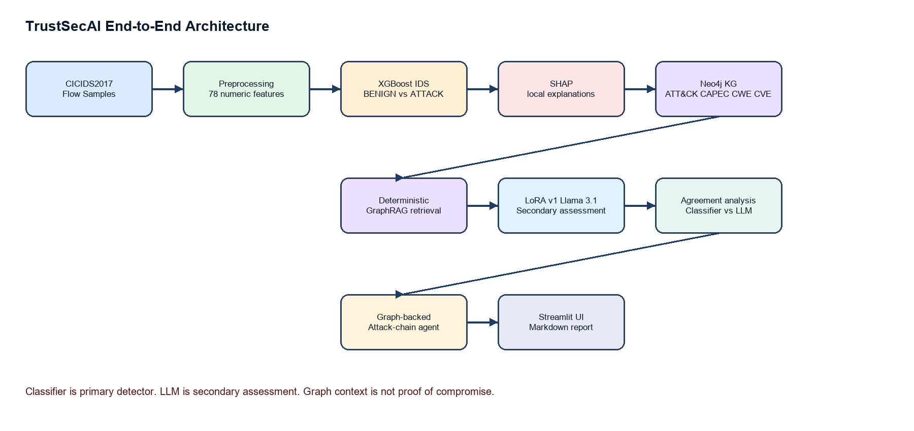
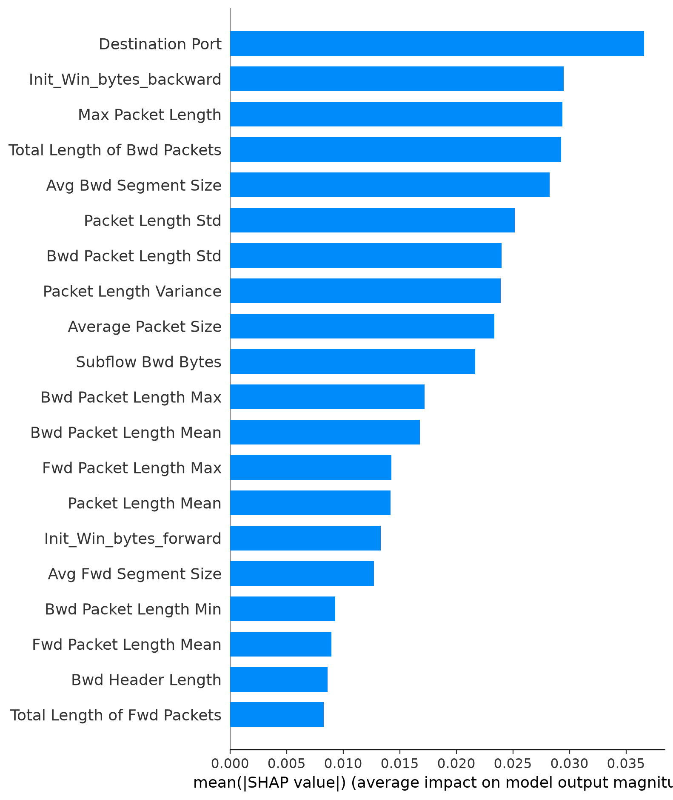
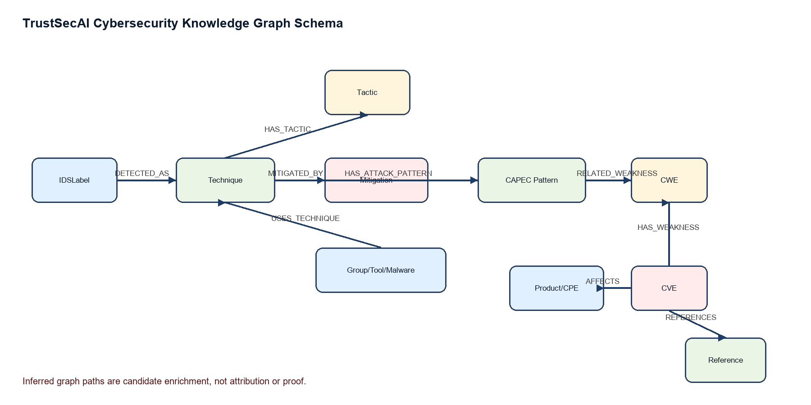
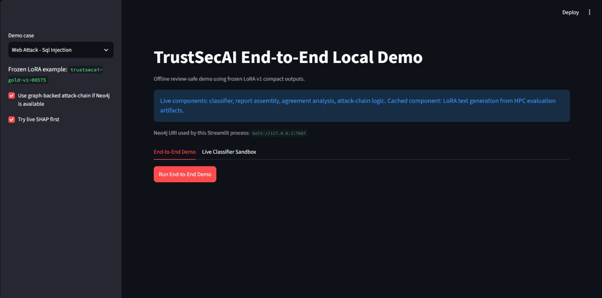

# TrustSecAI: Context-Aware Security Incident Analysis using GraphRAG and Explainable AI

**Rithvik Hemanth**  
Department of Computer Science and Engineering  
PES University, Bengaluru, India  
SRN: PES2UG23CS484

**Mentor:** Dr. Nazmin Begum  
Center of Cognitive Computing and Computational Intelligence  
Summer Internship, June-July 2026

## Abstract

Security operations centers receive large numbers of alerts that often identify suspicious behavior without providing enough explanation, threat-intelligence context, or prioritized response guidance. TrustSecAI addresses this gap by combining a binary XGBoost intrusion detection model trained on CICIDS2017, SHAP-based explainability, a Neo4j cybersecurity knowledge graph, deterministic GraphRAG retrieval, and a LoRA-adapted Llama 3.1 8B Instruct model for secondary analyst-style assessment. The framework treats the classifier as the primary detector and the LLM as a secondary assessment layer rather than ground truth. It also implements classifier-vs-LLM agreement analysis, graph-backed defensive attack-chain prediction with static fallback, and Streamlit/Markdown demo interfaces. The XGBoost classifier achieved random-split F1 of 0.997546 and ROC-AUC of 0.999982, while day-aware validation dropped to F1 of 0.532115 and ROC-AUC of 0.788955, exposing an important distribution-shift risk. The knowledge graph contains 10,034 nodes and 39,748 relationships across ATT&CK, CAPEC, CWE, NVD/CVE, CPE/product context, and IDS label mappings. LoRA v1 completed three epochs on the reviewed gold corpus with train loss 0.173604 and evaluation loss 0.132792. Compact held-out LoRA evaluation produced non-empty outputs for all 76 test examples, with 0.8289 JSON parse rate and no graph-proof wording flags. The resulting system demonstrates a reproducible, evidence-grounded workflow for transforming IDS alerts into contextual SOC triage reports.

**Index Terms** - Intrusion Detection, Explainable AI, SHAP, GraphRAG, Neo4j, MITRE ATT&CK, CAPEC, CWE, NVD, LoRA, Llama 3.1, SOC Automation.

## I. Introduction

Signature-based and machine-learning intrusion detection systems can identify suspicious traffic, but their outputs are often too narrow for practical security operations. A SOC analyst must determine whether an alert is credible, what evidence supports it, what external threat-intelligence context is relevant, which mitigations should be prioritized, and which follow-up investigations are justified. Raw IDS labels such as PortScan, DDoS, Bot, or Web Attack - Sql Injection do not directly answer these questions. They indicate a detection outcome, but they do not explain the classifier decision or connect the event to known adversary techniques, weaknesses, vulnerabilities, or defensive controls.

TrustSecAI was designed as a context-aware incident analysis framework. The central idea is to keep the machine-learning classifier as the primary detection mechanism while surrounding it with evidence interpretation and retrieval layers. SHAP explains which CICIDS flow features influenced the classifier decision. A Neo4j knowledge graph organizes ATT&CK techniques, tactics, mitigations, CAPEC patterns, CWE weaknesses, NVD/CVE records, products, references, and IDS label mappings. Deterministic GraphRAG retrieval converts a classifier label into structured context before it is supplied to the LLM. The LoRA-adapted Llama model then generates a secondary SOC-style assessment using only supplied evidence. Finally, agreement analysis and attack-chain prediction provide bounded triage signals rather than autonomous conclusions.

The main contributions are: (1) a CICIDS2017 binary IDS pipeline with random and day-aware validation; (2) SHAP global and local explanation outputs; (3) a Neo4j cybersecurity knowledge graph; (4) deterministic GraphRAG retrieval; (5) a reviewed gold SFT corpus and LoRA v1 fine-tuning of Llama 3.1 8B Instruct; (6) classifier-vs-LLM agreement analysis; (7) graph-backed defensive attack-chain prediction with static fallback; and (8) Streamlit and Markdown demo/reporting interfaces.

## II. Literature Survey and Research Gap

ML-based IDS research commonly focuses on improving detection accuracy using flow features or packet-derived statistics. Models such as random forests, gradient boosting, and neural networks can perform well on benchmark datasets, but high benchmark scores may hide temporal or capture-day distribution shift. The TrustSecAI experiments confirmed this problem: random split results were very high, while day-aware validation showed substantially lower recall.

Explainable AI methods such as SHAP help interpret classifier outputs by attributing predictions to input features. In cybersecurity, this is valuable because analysts need to know whether a detection was driven by meaningful traffic behavior or by artifacts. However, explanation alone does not supply threat-intelligence context.

Threat-intelligence knowledge graphs address a different limitation. ATT&CK, CAPEC, CWE, and NVD provide structured knowledge about adversary behavior, attack patterns, software weaknesses, vulnerabilities, and affected platforms. RAG and GraphRAG methods retrieve external context before generation. TrustSecAI integrates these ideas into one workflow rather than stopping at detection, explanation, graph retrieval, or summarization alone.

**Table A. Related work gap summary.**

| Existing area | Common limitation | TrustSecAI contribution |
| --- | --- | --- |
| ML-based IDS | Often reports detection metrics without analyst context | Adds SHAP, graph context, LLM secondary assessment, and reports |
| XAI for security | Explains model features but not broader threat context | Converts SHAP evidence into SOC-readable report sections |
| Threat-intelligence graphs | Stores structured CTI but may not connect to live classifier outputs | Links IDS labels to ATT&CK and downstream CAPEC/CWE/CVE context |
| RAG/GraphRAG | Retrieval may be vector-only or difficult to audit | Uses deterministic graph traversal and explicit provenance |
| LLM incident writing | Can hallucinate identifiers or attribution | Uses reviewed SFT data, frozen evidence, validation, and caveats |

The research gap is therefore not a missing individual component, but a missing integration pattern. TrustSecAI is designed as a chained evidence workflow: classifier output is explained by SHAP, enriched by graph retrieval, interpreted by a fine-tuned LLM, checked by deterministic agreement logic, and finally converted into a bounded report. Each stage preserves its input and output artifacts so that a reviewer can trace how the final conclusion was produced.

## III. Problem Statement and Design Objectives

Given a CICIDS-style network-flow sample or IDS alert, the system must generate an analyst-readable security assessment that explains the classifier output, retrieves relevant threat-intelligence context, identifies agreement or uncertainty between the classifier and LLM assessment, and suggests defensive investigation pivots without overclaiming compromise or attribution.

Functional requirements include BENIGN/ATTACK detection, SHAP explanation, ATT&CK/CAPEC/CWE/CVE retrieval, secondary LLM assessment, agreement analysis, bounded attack-chain prediction, and final report generation. Non-functional requirements include reproducibility, evidence grounding, no unsupported attribution, no offensive guidance, and offline demo reliability.

The design objective can be summarized as evidence preservation. The output must answer six analyst questions: What did the classifier predict? What confidence did it assign? Which flow features influenced the prediction? Which ATT&CK technique and tactic provide relevant behavioral context? Which mitigations and candidate vulnerability records are available? What uncertainty remains? These questions intentionally separate observed classifier evidence from retrieved contextual intelligence. This separation prevents the system from treating graph paths as confirmed attacker behavior.

TrustSecAI also includes safety-oriented design objectives. The system must avoid unsupported actor attribution, avoid unsupported CVE claims, avoid asset-exposure claims unless the input contains asset evidence, and avoid offensive procedure generation. The attack-chain agent is therefore described as an investigation-prioritization tool rather than an attack-planning tool. This wording is important because the same ATT&CK relationships that help defenders reason about follow-up activity could be misinterpreted if presented as an attacker playbook.

## IV. Dataset and Preprocessing

CICIDS2017 is the primary IDS training dataset. It contains flow-level features extracted from benign and attack traffic. TrustSecAI uses 78 numeric CICIDS flow features for the binary classifier. The original multiclass label is preserved in the label column, while the binary target maps BENIGN to 0 and every attack label to 1. The source_file column is retained for auditability and day-aware validation but is excluded from model training.

Preprocessing normalized columns, handled duplicate columns, converted feature columns to numeric values, replaced infinite values with missing values, removed invalid rows, removed duplicate rows, and normalized labels. The final cleaned dataset contains 2,520,798 rows after removing 309,945 rows from the raw total. Most removed rows were duplicates, with 2,867 rows removed for invalid, missing, or non-finite feature values.

Binary classification was chosen for the first complete TrustSecAI pipeline because it matches the project goal of live attack triage and keeps the downstream agreement workflow simple. Multiclass subtype prediction is future work. In the current demo and corpus, subtype context is taken from real CICIDS labels rather than invented multiclass probabilities.

**Table I. Dataset preprocessing summary.**

| Item | Value |
| --- | --- |
| Rows before cleaning | 2,830,743 |
| Rows after cleaning | 2,520,798 |
| Rows removed | 309,945 |
| Invalid/missing/non-finite rows | 2,867 |
| Duplicate rows removed | 307,078 |
| Model features | 78 |
| Binary target | BENIGN=0, ATTACK=1 |
| Audit column excluded | source_file |

The preprocessing pipeline is reproducible and conservative. It does not introduce new handcrafted cybersecurity features beyond the cleaned CICIDS flow fields. Instead, it preserves the cleaned numeric features and relies on the saved feature-order artifact to ensure that inference uses the same column order as training. This matters for the live demo because a model can silently produce invalid outputs if feature ordering changes. The live classifier sandbox explicitly displays the model path, feature count, and excluded metadata fields to make this visible to reviewers.

Class imbalance is also visible in the cleaned label distribution. BENIGN traffic forms 83.11 percent of the cleaned dataset, while individual attack subtypes vary widely. Web Attack - Sql Injection has only 21 rows after cleaning, while DDoS and PortScan have much larger counts. This imbalance is one reason the first implemented classifier is binary. A robust multiclass model would require additional care for rare classes and should be validated using temporal or day-aware splits rather than only random row mixing.

## V. IDS Classifier and SHAP Explainability

The final IDS model selected for the project is an XGBoost binary classifier. XGBoost was selected over the earlier random forest baseline because it achieved stronger day-aware performance and is efficient for tabular flow features. The classifier receives only the 78 numeric CICIDS feature columns. Non-feature fields such as label, binary_label, source_file, sample IDs, and metadata are excluded from inference. The saved model artifact is `models/xgboost/xgboost_model.joblib`, and feature order is preserved in `models/xgboost/feature_order.json`.

Two validation strategies were used. The random stratified 70/15/15 split evaluates performance when rows are mixed across the dataset. It produced excellent results, but this can be inflated if similar capture-day distributions appear in both train and test sets. A stricter day-aware validation trained on Monday through Thursday and tested on Friday. This produced much lower recall, indicating distribution shift across capture periods.

SHAP provides both global and local explanation. Global SHAP identifies features that frequently influence the classifier. Local SHAP explains an individual decision by reporting feature values and SHAP contributions. SHAP is framed carefully: it explains why the classifier made a prediction; it does not prove compromise.

**Table II. Top global SHAP features.**

| Rank | Feature | Mean abs. SHAP |
| --- | --- | --- |
| 1 | Destination Port | 0.036606 |
| 2 | Init_Win_bytes_backward | 0.029487 |
| 3 | Max Packet Length | 0.029379 |
| 4 | Total Length of Bwd Packets | 0.029245 |
| 5 | Avg Bwd Segment Size | 0.028244 |
| 6 | Packet Length Std | 0.025153 |
| 7 | Bwd Packet Length Std | 0.023995 |
| 8 | Packet Length Variance | 0.023926 |
| 9 | Average Packet Size | 0.023365 |
| 10 | Subflow Bwd Bytes | 0.021684 |

The classifier evaluation produced two complementary findings. Random split performance demonstrates that the model can learn the cleaned CICIDS feature space effectively. Day-aware evaluation demonstrates that this learning does not transfer equally across capture days. In the day-aware setting, precision remains high but recall drops substantially, meaning the model becomes conservative and misses many Friday attack rows. For a SOC tool, this is a serious operational issue because missed attacks matter more than a polished random-split score. TrustSecAI therefore reports both results and uses SHAP and graph context to support human review rather than claiming the classifier is deployment-ready.

Local SHAP explanations are used as evidence, not decoration. In the generated reports, only the strongest features are shown with feature value, SHAP value, and contribution direction. This makes the explanation actionable: an analyst can see whether the model relied on ports, packet lengths, flow rates, window sizes, or timing statistics. At the same time, SHAP values are model explanations; they are not independent forensic proof. The report language deliberately says that SHAP supports the classifier decision rather than proving compromise.

## VI. Cybersecurity Knowledge Graph and GraphRAG Retrieval

The knowledge graph is implemented in Neo4j and acts as the cybersecurity context layer. ATT&CK forms the behavioral spine. CAPEC contributes attack-pattern context, CWE provides a weakness bridge, NVD/CVE adds vulnerability intelligence, CPE/product nodes represent affected platforms, and IDSLabel nodes connect classifier/demo labels to ATT&CK techniques. The graph contains 10,034 nodes and 39,748 relationships.

Major node labels include IDSLabel, Technique, SubTechnique, Tactic, Mitigation, CAPECPattern, CWE, CVE, Product, Reference, Group, Tool, Malware, Campaign, and DetectionStrategy. Major relationships include DETECTED_AS, HAS_TACTIC, SUBTECHNIQUE_OF, MITIGATED_BY, USES_TECHNIQUE, USES_TOOL, USES_MALWARE, HAS_ATTACK_PATTERN, RELATED_WEAKNESS, HAS_WEAKNESS, AFFECTS, REFERENCES, and ASSOCIATED_CVE.

The deterministic GraphRAG layer starts from an IDS label, resolves the mapped ATT&CK technique, and retrieves structured context. The LLM does not query Neo4j directly. Retrieval builds structured JSON context before generation, which makes graph evidence auditable and reduces hallucination risk. Graph context is contextual intelligence, not confirmation of compromise or actor attribution.

**Table III. Major knowledge graph node counts.**

| Node label | Count |
| --- | --- |
| CAPECPattern | 615 |
| CVE | 1448 |
| CWE | 353 |
| Campaign | 56 |
| DetectionStrategy | 699 |
| Group | 189 |
| IDSLabel | 14 |
| Malware | 729 |
| Mitigation | 268 |
| Product | 383 |
| Reference | 4312 |
| SubTechnique | 493 |
| Tactic | 15 |
| Technique | 365 |
| Tool | 95 |

**Table IV. Selected relationship counts.**

| Relationship | Count |
| --- | --- |
| DETECTED_AS | 14 |
| HAS_TACTIC | 1090 |
| MITIGATED_BY | 1448 |
| HAS_ATTACK_PATTERN | 270 |
| RELATED_WEAKNESS | 779 |
| HAS_WEAKNESS | 1412 |
| AFFECTS | 2914 |
| REFERENCES | 4663 |
| USES_TECHNIQUE | 16903 |
| ASSOCIATED_CVE | 6741 |

**Table V. IDS label validation against ATT&CK and graph context.**

| IDS label | ATT&CK | Tactic | Mitigations | CAPEC | CWE | CVE | Products |
| --- | --- | --- | --- | --- | --- | --- | --- |
| PortScan | T1046 Network Service Discovery | Discovery | 3 | 1 | 1 | 37 | 30 |
| Web Attack - Sql Injection | T1190 Exploit Public-Facing Application | Initial Access | 8 | 0 | 0 | 0 | 0 |
| FTP-Patator | T1110 Brute Force | Credential Access | 4 | 1 | 2 | 3 | 2 |
| DDoS | T1498 Network Denial of Service | Impact | 1 | 0 | 0 | 0 | 0 |
| Bot | T1105 Ingress Tool Transfer | Command and Control | 2 | 0 | 0 | 0 | 0 |

Graph construction follows a provenance-first approach. Source-derived relationships are kept distinct from inferred relationships. For example, ATT&CK technique-to-tactic and mitigation relationships are direct behavioral knowledge. CAPEC/CWE/CVE expansion can be broader because CVEs may connect through shared weakness identifiers rather than through observed asset exposure. TrustSecAI therefore labels this as candidate enrichment and keeps caveats in the generated report. This prevents a common CTI mistake: assuming that a related vulnerability is relevant to the observed environment without confirming the affected product or exposed asset.

The retrieval layer is deterministic by design. It does not ask the LLM to search the graph or invent context. Instead, retrieval functions resolve the IDS label, collect graph neighbors up to bounded depth, rank or limit the result to avoid graph explosion, and package a compact JSON context. This context includes entity identifiers, names, relationship types, confidence/provenance where available, and evidence-completeness flags. The LLM receives this package as input and is instructed to use only supplied evidence. In this architecture, GraphRAG is not a vague prompt pattern; it is an auditable graph-query and context-building stage.

The graph also supports the attack-chain agent. For a seed technique such as T1046 Network Service Discovery, graph traversal can find tactics, mitigations, same-tactic candidate techniques, CAPEC/CWE/CVE context, and provenance. The output is capped to a small number of candidate next steps so that the report remains defensive and bounded. If Neo4j is unavailable, static fallback preserves demo reliability while clearly stating that fallback mode was used.

## VII. LoRA Fine-Tuning and LLM Integration

Llama 3.1 8B Instruct was selected as the open-weight base model because it provides instruction-following capability while remaining feasible for LoRA adaptation on available HPC resources. LoRA/PEFT was used instead of full fine-tuning to reduce trainable parameter count and preserve the base model weights.

The strict reviewed corpus contains 492 approved examples. The train, validation, and test splits contain 338, 78, and 76 examples respectively, with no base-context leakage across splits. Every example is grounded in classifier output, SHAP evidence, graph context, provenance, limitations, and recommended actions. Reviewer notes and checklist fields are excluded from training text.

Training used `meta-llama/Llama-3.1-8B-Instruct`, LoRA rank 16, alpha 32, dropout 0.05, and target modules q_proj, k_proj, v_proj, o_proj, gate_proj, up_proj, and down_proj. The maximum sequence length was 8192. Training ran for three epochs on the HPC/DGX Spark environment using no 4-bit loading. Runtime was approximately 38,628 seconds, or about 10.7 hours.

The local demo uses cached LoRA outputs from the completed HPC evaluation rather than live Llama inference. This is practical and reproducible: the local machine runs the classifier, agreement logic, graph-backed attack-chain traversal, and report assembly without GPU, while expensive Llama generation remains frozen and reviewable.

The corpus-design process changed during the project. An early large synthetic corpus was structurally valid but too repetitive in target outputs. Rather than scaling paraphrases over the same evidence, the dataset was redesigned around real evidence diversity. The reviewed gold v1 corpus was built from expanded real classifier samples, real local SHAP explanations, and existing retrieval contexts. A human-review workbook was generated, and the assistant-reviewed decision package approved 492 examples. The strict reviewed corpus was then exported for LoRA training, while unreviewed candidate examples were kept separate.

The LoRA output schema was intentionally compact. It includes fields such as IDS label, sample ID, classifier evidence, SHAP evidence, graph interpretation, limitations, provenance summary, and recommended actions. Compact output was necessary because the initial full inference run copied long provenance arrays and hit the generation token cap. After adding compact-output instructions, the final held-out run had no token-cap hits and produced much shorter outputs. This is an important engineering lesson: fine-tuned models still need runtime output constraints and validation.

Local integration uses a frozen LoRA output file rather than live generation. This is not a shortcut in the research sense; it is a reproducibility and resource-control choice. The frozen file was generated on the HPC after training and evaluated on the held-out split. The local demo then reuses those outputs while running the classifier, agreement logic, attack-chain logic, and report builder live. This makes the demo review-safe, avoids GPU dependency, and prevents accidental retraining or nondeterministic inference behavior during presentation.

## VIII. Agreement Analysis and Attack-Chain Agent

Agreement analysis compares the primary classifier signal with the parsed LLM secondary assessment. Its purpose is not to determine ground truth, but to identify whether the LLM assessment aligns with the classifier, expresses uncertainty, or highlights an evidence gap. Categories are agree_attack_high_confidence, agree_attack_low_confidence, llm_uncertain_classifier_attack, classifier_attack_llm_benign_or_uncertain, and evidence_gap.

The attack-chain agent is defensive and bounded. It starts from the IDS label and associated ATT&CK seed technique: Web Attack - Sql Injection maps to T1190, PortScan to T1046, FTP-Patator to T1110, Bot to T1105, and DDoS to T1498. When Neo4j and the Python driver are available, the agent performs bounded graph traversal; otherwise it falls back to static seed mappings. It does not generate exploit steps, payloads, attacker playbooks, or attribution.

Agreement analysis is implemented as deterministic scaffolding rather than another learned model. This makes the output easy to explain during review. A high-confidence ATTACK prediction with attack-relevant LLM language becomes agree_attack_high_confidence. If the LLM emphasizes uncertainty, the result becomes llm_uncertain_classifier_attack. If the LLM appears benign or false-positive oriented while the classifier predicts attack, the result becomes classifier_attack_llm_benign_or_uncertain. If essential evidence is missing, the result becomes evidence_gap. These categories are not ground truth; they are triage signals.

The attack-chain agent uses the current IDS label and ATT&CK seed mapping. Seed mappings are Web Attack - Sql Injection to T1190, PortScan to T1046, FTP-Patator to T1110, Bot to T1105, and DDoS to T1498. In graph-backed mode, Neo4j traversal retrieves defensive investigation pivots and mitigations. The agent never provides exploit payloads, detailed offensive procedures, or instructions for performing attacks. Its caveats explicitly state that graph traversal is a hypothesis-generation mechanism for defenders.

## IX. Results and Evaluation

The evaluation is divided into classifier performance, graph coverage, LoRA training/evaluation, and demo case behavior. The most important classifier result is not only the high random-split score but also the day-aware degradation. The latter exposes distribution shift and supports the project argument that contextual, explainable assessment is necessary.

**Table VI. XGBoost classifier performance.**

| Evaluation | Accuracy | Precision | Recall | F1 | ROC-AUC |
| --- | --- | --- | --- | --- | --- |
| Random split | 0.999170 | 0.995601 | 0.999499 | 0.997546 | 0.999982 |
| Day-aware | 0.771359 | 0.999101 | 0.362623 | 0.532115 | 0.788955 |

**Table VII. LoRA v1 training and compact evaluation.**

| Metric | Value |
| --- | --- |
| Base model | Llama-3.1-8B-Instruct |
| Epochs | 3 |
| Runtime | ~10.7 h |
| Train loss | 0.173604 |
| Eval loss | 0.132792 |
| Eval token accuracy | 0.982005 |
| Held-out examples | 76 |
| Non-empty rate | 1.0 |
| Error rate | 0.0 |
| Token cap hit rate | 0.0 |
| JSON parse rate | 0.8289 |
| Metadata coverage | 1.0 |
| Unsupported CWE count | 4 |
| Graph proof wording count | 0 |

**Table VIII. Final demo cases.**

| IDS label | example_id | ATT&CK | Confidence | Attack-chain mode |
| --- | --- | --- | --- | --- |
| Web Attack - Sql Injection | trustsecai-gold-v1-00575 | T1190 | 0.983210 | graph |
| PortScan | trustsecai-gold-v1-00178 | T1046 | 0.998606 | graph |
| FTP-Patator | trustsecai-gold-v1-00810 | T1110 | 0.999981 | graph |
| Bot | trustsecai-gold-v1-00381 | T1105 | 0.999968 | graph |
| DDoS | trustsecai-gold-v1-00128 | T1498 | 0.999999 | graph |

Graph evaluation focuses on coverage and correctness of retrieval paths. All five final demo labels resolve to ATT&CK techniques. PortScan has the richest expansion among the final cases, with CAPEC, CWE, CVE, and product context. FTP-Patator also has CAPEC, CWE, CVE, and product context through brute-force-related mappings. SQL Injection, DDoS, and Bot resolve to ATT&CK techniques and mitigations but do not have local CAPEC/CWE/CVE expansion in the current graph snapshot. The reports preserve these gaps rather than filling them with unsupported information.

LoRA evaluation is interpreted cautiously. The compact evaluation succeeded mechanically: every held-out example produced non-empty output, no traceback was detected, metadata coverage was complete, and no graph-proof wording was flagged. However, JSON parse rate was 0.8289, so the response parser still needs fallback behavior. Four unsupported CWE mentions were also detected. These limitations are reported because research integrity is more important than presenting a perfect-looking score.

## X. Demo System and Screenshots

The final demonstration has two Streamlit views. The end-to-end view lets a reviewer choose one of the five final IDS cases and run the lightweight local pipeline. The classifier inference, report assembly, agreement analysis, and attack-chain logic run locally. LoRA text generation is loaded from frozen HPC evaluation outputs. Neo4j is optional for the UI; if unavailable, the attack-chain agent uses static fallback.

The second view is the live classifier sandbox. It lets a reviewer select a base CICIDS sample, manually edit numeric feature values, and rerun the saved XGBoost classifier. This proves the classifier output is not hardcoded. The UI states that labels, source_file, and metadata are never passed into the model and warns that unrealistic manual edits may produce unrealistic predictions.

No actual Streamlit screenshot files were found in the repository at generation time. The DOCX therefore contains explicit figure placeholders for manual insertion.

The Streamlit demo is intentionally split into an end-to-end view and a classifier sandbox. The end-to-end view demonstrates the complete TrustSecAI reasoning flow: live classifier inference, SHAP evidence, graph context, frozen LoRA assessment, agreement analysis, attack-chain hypothesis, and final report. The sandbox allows reviewers to manually edit CICIDS numeric features and rerun the classifier. This directly addresses the reviewer question of whether the classifier is working live or whether outputs are hardcoded. The edited-input prediction is computed from a one-row dataframe in the exact saved feature order.

The following screenshots should be inserted manually from the working Streamlit UI before final submission. Screenshot placeholders are kept in both the Markdown and DOCX sources so the report can be completed without fabricating images.

### Uploaded Demo Screenshots

## XI. Discussion

The largest technical lesson is that evaluation strategy changes the story. Random-split IDS metrics are very high, but day-aware validation reveals a generalization gap. This does not invalidate the classifier; rather, it makes the project more realistic. A SOC tool must expose uncertainty and distribution shift instead of presenting a single inflated score.

Graph context is useful because it turns a narrow IDS label into a richer security frame. However, graph-derived context must be treated carefully. A CVE connected through a CWE bridge is candidate enrichment, not proof that the affected product exists in the observed environment. The LLM contributes language generation and analyst-style synthesis, but it is not the detector and not ground truth.

The demo intentionally distinguishes live and cached components. The classifier runs live, and the sandbox proves the classifier reacts to feature edits. Agreement, attack-chain logic, and report assembly also run live. LoRA generation is cached from HPC outputs because local live inference would require GPU resources and could introduce nondeterministic delays during review.

The TrustSecAI design reduces analyst cognitive load by organizing evidence into a consistent report structure. Instead of requiring an analyst to separately inspect classifier output, SHAP plots, ATT&CK pages, CAPEC patterns, CVE records, and LLM text, the system packages them into a single assessment. The benefit is not full automation of incident response. The benefit is faster triage with explicit evidence boundaries.

The separation of live and cached components is also a practical deployment lesson. The classifier is lightweight enough for local live inference. Neo4j traversal is local and optional. Llama 3.1 8B inference is resource-intensive and better suited to an HPC or GPU-backed service. Freezing LoRA outputs for the local demo lets reviewers inspect the integration without waiting for generation or risking GPU-related failures.

## XII. Limitations

The current IDS model is binary rather than multiclass. IDS subtype context used by the corpus and demo comes from real CICIDS labels and should not be interpreted as multiclass classifier probabilities. The day-aware validation result shows low recall under capture-day shift, so production deployment would require additional validation, model adaptation, or improved feature engineering.

The local demo uses frozen LoRA outputs rather than live Llama inference. LoRA v1 also has imperfect JSON adherence: 63 of 76 compact held-out outputs parsed as JSON, and four unsupported CWE mentions were detected. Graph context is candidate intelligence, not confirmed compromise. CVE/CWE enrichment does not prove asset exposure. There is no real-time packet capture or flow generation pipeline yet.

There are also UI and operational limitations. The Streamlit demo is designed for review, not production SOC deployment. It does not yet include authentication, role-based access, case management, alert queues, ticketing integration, or persistent analyst feedback. The classifier sandbox is valuable for demonstrating live inference, but manually edited feature values may not represent realistic network flows. In production, feature values should come from a trusted flow generator rather than manual input.

Another limitation is evidence scope. The graph contains a useful local snapshot, but NVD/CVE feeds are partial/recent snapshots rather than a complete historical mirror. CVE retrieval through CWE can over-retrieve without asset context. A deployment would need asset inventory, product fingerprinting, and vulnerability scanner integration before claiming that a CVE is relevant to a specific organization.

## XIII. Conclusion and Future Work

TrustSecAI demonstrates an end-to-end defensive cybersecurity research prototype that moves beyond raw IDS detection. It integrates XGBoost-based attack detection, SHAP explainability, Neo4j threat-intelligence graph retrieval, LoRA-assisted secondary assessment, classifier-vs-LLM agreement analysis, graph-backed attack-chain prediction, and reviewer-facing Streamlit/Markdown reporting.

Future work includes multiclass IDS modeling, stronger day-aware generalization, live GPU-backed LoRA inference, constrained JSON decoding, temporal alert correlation, analyst-feedback calibration, a real packet/flow ingestion pipeline, graph ranking with provenance scores, expansion of the reviewed SFT corpus, and integration into a production-style SOC workflow.

## References

[1] I. Sharafaldin, A. H. Lashkari, and A. A. Ghorbani, "Toward generating a new intrusion detection dataset and intrusion traffic characterization," ICISSP, 2018.
[2] T. Chen and C. Guestrin, "XGBoost: A scalable tree boosting system," Proc. ACM SIGKDD, 2016.
[3] S. M. Lundberg and S.-I. Lee, "A unified approach to interpreting model predictions," Proc. NeurIPS, 2017.
[4] MITRE, "MITRE ATT&CK Enterprise Matrix," online knowledge base.
[5] MITRE, "Common Attack Pattern Enumeration and Classification (CAPEC)," online taxonomy.
[6] MITRE, "Common Weakness Enumeration (CWE)," online taxonomy.
[7] National Institute of Standards and Technology, "National Vulnerability Database (NVD)," online vulnerability database.
[8] National Institute of Standards and Technology, "Common Platform Enumeration (CPE)," online naming scheme.
[9] Neo4j, "Neo4j Graph Database Documentation," Neo4j Inc.
[10] P. Lewis et al., "Retrieval-Augmented Generation for Knowledge-Intensive NLP Tasks," Proc. NeurIPS, 2020.
[11] E. Hu et al., "LoRA: Low-Rank Adaptation of Large Language Models," Proc. ICLR, 2022.
[12] Hugging Face, "PEFT: Parameter-Efficient Fine-Tuning," software documentation.
[13] Meta AI, "Llama 3.1 model family and model card," 2024.
[14] Streamlit, "Streamlit application framework documentation," online documentation.